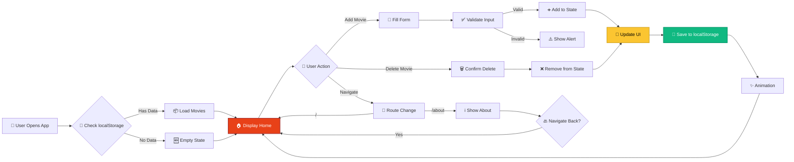
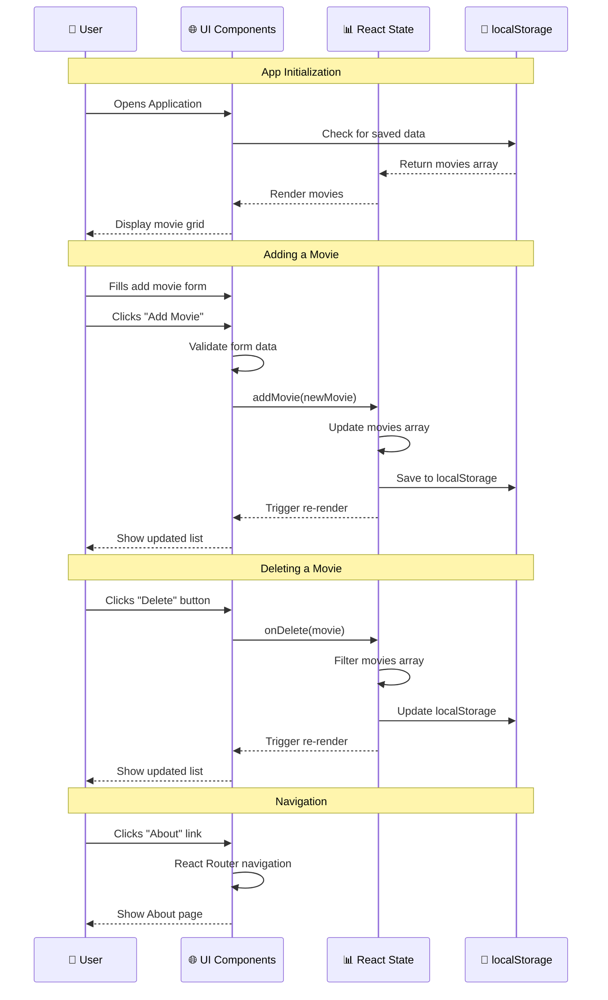

# <div align="center">🎬 My Movies List - React Application</div>

<div align="center">


[](https://git.io/typing-svg)

<p align="center">
  
  
  
  
</p>

<p align="center">
  
  
  
  
</p>

<p align="center">
  <a href="#-overview">📖 Overview</a> •
  <a href="#-features">✨ Features</a> •
  <a href="#-architecture">🏗️ Architecture</a> •
  <a href="#-workflow">🔄 Workflow</a> •
  <a href="#-installation">⚡ Setup</a> •
  <a href="#-usage">🎯 Usage</a>
</p>


</div>

## 📖 Table of Contents

- [🎯 Overview](#-overview)
- [🌟 Key Features](#-key-features)
- [🎥 Live Demo](#-live-demo)
- [🏗️ Architecture](#️-architecture)
- [🔄 Application Workflow](#-application-workflow)
- [💻 Tech Stack](#-tech-stack)
- [⚡ Installation & Setup](#-installation--setup)
- [🎯 Usage Guide](#-usage-guide)
- [📂 Project Structure](#-project-structure)
- [🎨 Styling Guide](#-styling-guide)
- [🛠️ Configuration](#️-configuration)
- [🚀 Deployment](#-deployment)
- [🤝 Contributing](#-contributing)
- [📄 License](#-license)
- [👨‍💻 About Creator](#-about-creator)

---

## 🎯 Overview

<div align="center">

```ascii
╔═══════════════════════════════════════════════════════════════════╗
║                                                                   ║
║          🎬  My First React Project - Movies List  🎬            ║
║                                                                   ║
║       Personal Movie Collection Manager with Modern UI           ║
║                                                                   ║
╚═══════════════════════════════════════════════════════════════════╝
```

</div>

**This is my first React project** implementing a complete **Movie Collection Manager** with **localStorage persistence** and **React Router navigation**. The project demonstrates modern React development practices with component-based architecture, state management, and responsive design.

### 🎯 What This Project Does

<table>
<tr>
<td align="center" width="25%">

<br><b>Add Movies</b>
<br><sub>Create your collection</sub>
</td>
<td align="center" width="25%">

<br><b>Rate Movies</b>
<br><sub>Track your ratings 0-10</sub>
</td>
<td align="center" width="25%">

<br><b>Delete Movies</b>
<br><sub>Remove from collection</sub>
</td>
<td align="center" width="25%">

<br><b>Auto Save</b>
<br><sub>localStorage persistence</sub>
</td>
</tr>
</table>

> **💡 Learning Journey**: "This project marks my first step into React development. I've successfully implemented component-based architecture, React Hooks (useState, useEffect), React Router for navigation, and created a production-ready application with modern UI/UX design."

---

## 🌟 Key Features

<div align="center">

### 💎 Application Capabilities

</div>

<table>
<tr>
<td width="50%" valign="top">

### ⚛️ **React Components**


Modular, reusable components following React best practices for maintainable code.

**🎯 Component Features:**
- ✅ Functional components with hooks
- ✅ Props for data passing
- ✅ Component composition
- ✅ Separation of concerns
- ✅ Reusable UI elements
- ✅ Clean code architecture

**💡 Components:**
```
├── Header (Navigation)
├── AddMovie (Form)
├── Movies (List Container)
├── Moivetitle (Individual Card)
├── About (Info Page)
└── Footer (Copyright)
```

</td>
<td width="50%" valign="top">

### 🎨 **Modern UI/UX**


Beautiful dark theme with gradient effects, glassmorphism, and smooth animations.

**🔍 Design Features:**
- ✅ Dark gradient background
- ✅ Glassmorphism cards
- ✅ Smooth hover effects
- ✅ Responsive grid layout
- ✅ Professional typography
- ✅ CSS animations

**📊 Design System:**
```css
Colors:
  Primary: #E84118 (Red-Orange)
  Secondary: #FBC531 (Gold)
  Background: #1A1A2E → #0F3460
  Text: #DFE6E9 (Light Gray)
```

</td>
</tr>

<tr>
<td width="50%" valign="top">

### 💾 **Data Persistence**


Automatic saving to browser's localStorage ensures your data never gets lost.

**🎭 Storage Benefits:**
- ✅ Automatic save on changes
- ✅ Data persists after refresh
- ✅ No backend required
- ✅ Fast load times
- ✅ Works offline
- ✅ useEffect hook integration

**🌈 Implementation:**
```javascript
// Auto-save with useEffect
useEffect(() => {
  localStorage.setItem(
    "movies", 
    JSON.stringify(movies)
  );
}, [movies]);
```

</td>
<td width="50%" valign="top">

### 🧭 **React Router Navigation**


Smooth single-page application navigation with React Router v6.

**💼 Routing Features:**
- ✅ Client-side routing
- ✅ Clean URL structure
- ✅ Link components
- ✅ Multiple pages (Home, About)
- ✅ No page reloads
- ✅ Browser history support

**🎯 Routes:**
```javascript
/ (Home)
  ├── AddMovie Form
  └── Movies Grid
  
/about (About Page)
  └── Project Information
```

</td>
</tr>
</table>

<div align="center">

### 🎓 **First-Time Implementation Highlights**

<table>
<tr>
<td align="center">🎉<br><b>First React Project</b></td>
<td align="center">⚛️<br><b>React Hooks Mastery</b></td>
<td align="center">🎨<br><b>Modern CSS Design</b></td>
<td align="center">📱<br><b>Fully Responsive</b></td>
<td align="center">💾<br><b>localStorage Integration</b></td>
</tr>
</table>

</div>

---

## 🎥 Live Demo

<div align="center">

### 🌐 **Application Screenshots**

<table>
<tr>
<td width="50%" align="center">

<br><b>🏠 Home Page</b>
<br><sub>Add movies • Grid view • Beautiful cards</sub>
</td>
<td width="50%" align="center">

<br><b>➕ Add Movie Form</b>
<br><sub>Title • Year • Rating input</sub>
</td>
</tr>
<tr>
<td width="50%" align="center">

<br><b>🎬 Movie Cards</b>
<br><sub>Hover effects • Delete • Update rating</sub>
</td>
<td width="50%" align="center">

<br><b>ℹ️ About Page</b>
<br><sub>Project information • Navigation</sub>
</td>
</tr>
</table>

### 🎯 **Key Statistics**

| Property | Details |
|----------|---------|
| 📦 **Total Components** | 6 Components |
| 🎨 **CSS Files** | 5 Stylesheets |
| ⚛️ **React Version** | 18.2+ |
| 🧭 **Routing** | React Router v6 |
| 📱 **Responsive** | ✅ Mobile, Tablet, Desktop |
| 💾 **Storage** | localStorage API |

</div>

---

## 🏗️ Architecture

<div align="center">

### **Application Architecture**

```mermaid
graph TB
    subgraph "User Interface Layer"
        A[🌐 Browser]
        B[⚛️ React App]
    end
    
    subgraph "Component Layer"
        C[🎯 App.js<br/>Main Component]
        D[🧭 Header<br/>Navigation]
        E[➕ AddMovie<br/>Form]
        F[📋 Movies<br/>List Container]
        G[🎬 Moivetitle<br/>Movie Card]
        H[ℹ️ About<br/>Info Page]
        I[📄 Footer<br/>Copyright]
    end
    
    subgraph "State Management"
        J[📊 useState<br/>Movies Array]
        K[🔄 useEffect<br/>Auto-save]
    end
    
    subgraph "Routing Layer"
        L[🧭 React Router]
        M[/ Route<br/>Home]
        N[/about Route<br/>About]
    end
    
    subgraph "Data Layer"
        O[💾 localStorage]
        P[📦 Movies Data]
    end
    
    A --> B
    B --> C
    C --> D
    C --> L
    L --> M
    L --> N
    M --> E
    M --> F
    N --> H
    C --> I
    F --> G
    C --> J
    C --> K
    K --> O
    O --> P
    J -.Update.-> F
    E -.Add.-> J
    G -.Delete.-> J
    
    style C fill:#E84118,stroke:#a83232,stroke-width:3px,color:#fff
    style J fill:#FBC531,stroke:#d4a729,stroke-width:3px,color:#000
    style O fill:#10B981,stroke:#059669,stroke-width:3px,color:#fff
```

### **Component Hierarchy**

```
┌─────────────────────────────────────────────────────────────────┐
│                         APP.JS (Root)                           │
│                     State Management Hub                        │
├─────────────────────────────────────────────────────────────────┤
│                                                                 │
│  ┌──────────────┐    ┌──────────────┐    ┌──────────────┐    │
│  │    Header    │    │ React Router │    │    Footer    │    │
│  │  Navigation  │    │   Routes     │    │  Copyright   │    │
│  └──────────────┘    └──────────────┘    └──────────────┘    │
│                              │                                  │
│                    ┌─────────┴─────────┐                      │
│                    │                   │                       │
│            ┌───────▼──────┐    ┌──────▼──────┐               │
│            │  / (Home)    │    │   /about    │               │
│            │              │    │             │               │
│            │ ┌──────────┐ │    │ ┌─────────┐ │               │
│            │ │ AddMovie │ │    │ │  About  │ │               │
│            │ │   Form   │ │    │ │  Page   │ │               │
│            │ └──────────┘ │    │ └─────────┘ │               │
│            │              │    │             │               │
│            │ ┌──────────┐ │    │             │               │
│            │ │  Movies  │ │    │             │               │
│            │ │Container │ │    │             │               │
│            │ └────┬─────┘ │    │             │               │
│            │      │       │    │             │               │
│            │   ┌──▼────┐  │    │             │               │
│            │   │Moviet-│  │    │             │               │
│            │   │itle × │  │    │             │               │
│            │   │  N    │  │    │             │               │
│            │   └───────┘  │    │             │               │
│            └──────────────┘    └─────────────┘               │
│                                                                 │
│                    ┌──────────────┐                            │
│                    │ localStorage │                            │
│                    │  Persistence │                            │
│                    └──────────────┘                            │
│                                                                 │
└─────────────────────────────────────────────────────────────────┘
```

</div>

---

## 🔄 Application Workflow

<div align="center">

### **Complete User Flow**

</div>



### **Data Flow Diagram**



### **Detailed Workflow Stages**

<table>
<tr>
<td width="20%" align="center">

**1️⃣ Initialize**
```
Load App
↓
Check Storage
↓
Set State
```

</td>
<td width="20%" align="center">

**2️⃣ Display**
```
Map Movies
↓
Render Cards
↓
Apply Styles
```

</td>
<td width="20%" align="center">

**3️⃣ Add Movie**
```
Fill Form
↓
Validate
↓
Update State
```

</td>
<td width="20%" align="center">

**4️⃣ Save**
```
useEffect
↓
Stringify
↓
localStorage
```

</td>
<td width="20%" align="center">

**5️⃣ Update UI**
```
Re-render
↓
Animations
↓
User Sees
```

</td>
</tr>
</table>

### **State Management Flow**

```yaml
State Management:
  ├─ Initial State
  │  ├─ Check localStorage
  │  ├─ Parse JSON data
  │  └─ Set movies array
  │
  ├─ Add Movie Flow
  │  ├─ User submits form
  │  ├─ Create movie object
  │  ├─ Spread operator [...movies, newMovie]
  │  └─ Trigger useEffect
  │
  ├─ Delete Movie Flow
  │  ├─ User clicks delete
  │  ├─ Filter movies array
  │  ├─ Update state
  │  └─ Trigger useEffect
  │
  └─ Persistence Flow
     ├─ useEffect listens to movies
     ├─ JSON.stringify(movies)
     ├─ localStorage.setItem()
     └─ Data saved ✅
```

---

## 💻 Tech Stack

<div align="center">

### **Frontend Technologies**


### **Development & Build Tools**


### **React Features Used**


### **Browser APIs**


</div>

### **Detailed Tech Stack**

<table>
<tr>
<td width="50%" valign="top">

#### **Frontend Framework**
- **React 18.2+**
  - Component-based architecture
  - Virtual DOM for performance
  - Declarative UI
  - JSX syntax

#### **State Management**
- **React Hooks**
  - `useState` - Movie list state
  - `useEffect` - localStorage sync
  - Functional components only

#### **Routing**
- **React Router DOM v6**
  - Client-side routing
  - `<Routes>` and `<Route>`
  - `<Link>` components
  - Browser history API

</td>
<td width="50%" valign="top">

#### **Styling**
- **Custom CSS3**
  - CSS Grid layouts
  - Flexbox alignment
  - CSS animations
  - Gradient backgrounds
  - Glassmorphism effects
  - Media queries

#### **Data Persistence**
- **localStorage API**
  - Browser storage
  - JSON serialization
  - Automatic saving
  - Data persistence

#### **Build Tools**
- **Create React App**
  - Webpack bundling
  - Babel transpilation
  - Hot reloading
  - Development server

</td>
</tr>
</table>

---

## ⚡ Installation & Setup

### 📋 **Prerequisites**

```bash
✓ Node.js 14.0 or higher
✓ npm 6.0 or higher (comes with Node.js)
✓ Git (for cloning repository)
✓ Modern web browser (Chrome, Firefox, Safari, Edge)
✓ Code editor (VS Code recommended)
```

### 🚀 **Quick Start Guide**

#### **Step 1: Clone the Repository**

```bash
# Clone the project
git clone https://github.com/yourusername/my-movies-list.git

# Navigate to project directory
cd my-movies-list
```

#### **Step 2: Install Dependencies**

```bash
# Install all npm packages
npm install

# This installs:
# - react
# - react-dom
# - react-router-dom
# - react-scripts
# And all development dependencies
```

#### **Step 3: Start Development Server**

```bash
# Start the app in development mode
npm start

# The app will automatically open at:
# http://localhost:3000

# Hot reload is enabled - changes appear instantly!
```

#### **Step 4: Build for Production** (Optional)

```bash
# Create optimized production build
npm run build

# Creates a 'build' folder with:
# - Minified JavaScript
# - Optimized CSS
# - Compressed assets
# Ready for deployment!
```

### 🔧 **Alternative Setup Methods**

#### **Method 1: Using Yarn**

```bash
# Install dependencies with Yarn
yarn install

# Start development server
yarn start

# Build for production
yarn build
```

#### **Method 2: Using npx (No Clone)**

```bash
# Create a new React app with the same structure
npx create-react-app my-movies-list

# Navigate to the folder
cd my-movies-list

# Copy the component files and start
npm start
```

### 📦 **Package.json Scripts**

```json
{
  "scripts": {
    "start": "react-scripts start",     // Development server
    "build": "react-scripts build",     // Production build
    "test": "react-scripts test",       // Run tests
    "eject": "react-scripts eject"      // Eject from CRA
  }
}
```

### 🛠️ **Development Environment Setup**

```bash
# Recommended VS Code Extensions:
- ES7+ React/Redux/React-Native snippets
- Prettier - Code formatter
- ESLint
- Auto Rename Tag
- Bracket Pair Colorizer

# Install globally (optional):
npm install -g serve    # For serving production build locally
```

---

## 🎯 Usage Guide

### **Application Features Walkthrough**

#### **1️⃣ Adding a Movie**

```javascript
// Step-by-step process:

1. Navigate to Home page (/)
2. Locate "Add a New Movie" form
3. Fill in the details:
   - Movie Title (e.g., "Inception")
   - Release Year (e.g., 2010)
   - Rating (0-10, e.g., 8.8)
4. Click "🎬 Add Movie" button
5. Movie appears in grid below
6. Automatically saved to localStorage

// Example movie object:
{
  title: "Inception",
  releaseYear: 2010,
  rating: 8.8
}
```

#### **2️⃣ Viewing Movies**

```javascript
// Movie cards display:
- Movie title (gradient text)
- Release year with 📅 icon
- Rating with ⭐ icon (out of 10)
- Update Rating button (✏️)
- Delete button (🗑️)

// Grid layout:
- Responsive grid (auto-fit columns)
- Minimum 320px per card
- Gap between cards
- Hover effects for interaction
```

#### **3️⃣ Deleting a Movie**

```javascript
// Deletion process:

1. Find the movie card you want to remove
2. Click the "🗑️ Delete" button
3. Movie is immediately removed
4. State updates automatically
5. localStorage syncs
6. UI re-renders without the movie

// Under the hood:
const onDelete = (movie) => {
  setMovies(movies.filter((e) => e !== movie));
};
```

#### **4️⃣ Navigation**

```javascript
// Available routes:

1. Home (/)
   - AddMovie form
   - Movies grid
   - All functionality

2. About (/about)
   - Project information
   - Learning journey
   - Technology used

// Navigation usage:
<Link to="/">Home</Link>
<Link to="/about">About</Link>
```

### **Component Usage Examples**

#### **Using the AddMovie Component**

```jsx
// Parent component (App.js)
import AddMovie from './myComponents/addmoives';

function App() {
  const [movies, setMovies] = useState([]);
  
  const addMovie = (movie) => {
    setMovies([...movies, movie]);
  };
  
  return (
    <AddMovie addMovie={addMovie} />
  );
}

// The component handles:
// - Form state management
// - Input validation
// - Calling parent's addMovie function
// - Clearing form after submission
```

#### **Using the Movies Component**

```jsx
// Display movies list
import Movies from './myComponents/Moives';

function App() {
  const [movies, setMovies] = useState([
    { title: "Inception", releaseYear: 2010, rating: 8.8 }
  ]);
  
  const onDelete = (movie) => {
    setMovies(movies.filter((e) => e !== movie));
  };
  
  return (
    <Movies movies={movies} onDelete={onDelete} />
  );
}

// Renders:
// - Grid of movie cards
// - Empty state if no movies
// - Delete functionality for each
```

---

## 📂 Project Structure

```
my-movies-list/
│
├── public/
│   ├── index.html              # HTML template
│   ├── favicon.ico             # App icon
│   └── manifest.json           # PWA manifest
│
├── src/
│   ├── myComponents/
│   │   ├── About.js            # About page component
│   │   ├── About.css           # About page styles
│   │   ├── addmoives.js        # Add movie form component
│   │   ├── AddMovie.css        # Form styles
│   │   ├── footer.js           # Footer component
│   │   ├── Footer.css          # Footer styles
│   │   ├── Header.js           # Navigation header
│   │   ├── Header.css          # Header styles
│   │   ├── Moivetitle.js       # Individual movie card
│   │   ├── Moives.js           # Movies list container
│   │   └── Movies.css          # Movies grid styles
│   │
│   ├── App.js                  # Main app component
│   ├── App.css                 # Global app styles
│   ├── index.js                # React entry point
│   ├── index.css               # Global styles
│   └── logo.svg                # React logo
│
├── package.json                # Dependencies and scripts
├── package-lock.json           # Locked versions
├── .gitignore                  # Git ignore rules
└── README.md                   # This file
```

### **Component Breakdown**

<table>
<tr>
<th>Component</th>
<th>Purpose</th>
<th>Props</th>
<th>State</th>
</tr>
<tr>
<td><b>App.js</b></td>
<td>Root component, manages global state and routing</td>
<td>None</td>
<td>movies array</td>
</tr>
<tr>
<td><b>Header</b></td>
<td>Navigation bar with links and search</td>
<td>title, searchBar</td>
<td>isOpen (mobile menu)</td>
</tr>
<tr>
<td><b>AddMovie</b></td>
<td>Form to add new movies</td>
<td>addMovie function</td>
<td>title, year, rating</td>
</tr>
<tr>
<td><b>Movies</b></td>
<td>Container for movie cards grid</td>
<td>movies, onDelete</td>
<td>None</td>
</tr>
<tr>
<td><b>Moivetitle</b></td>
<td>Individual movie card display</td>
<td>title, year, rating</td>
<td>None</td>
</tr>
<tr>
<td><b>About</b></td>
<td>Information about the project</td>
<td>None</td>
<td>None</td>
</tr>
<tr>
<td><b>Footer</b></td>
<td>Copyright and footer info</td>
<td>None</td>
<td>None</td>
</tr>
</table>

---

## 🎨 Styling Guide

### **Color Palette**

```css
/* Primary Colors */
--primary-red: #E84118;      /* Main accent color */
--primary-gold: #FBC531;     /* Secondary accent */

/* Background Gradients */
--bg-dark-1: #1A1A2E;        /* Dark navy */
--bg-dark-2: #16213E;        /* Medium navy */
--bg-dark-3: #0F3460;        /* Blue navy */

/* Text Colors */
--text-light: #DFE6E9;       /* Light gray text */
--text-white: #FFFFFF;       /* Pure white */

/* Gradients */
background: linear-gradient(135deg, #E84118, #FBC531);
background: linear-gradient(135deg, #1A1A2E 0%, #16213E 50%, #0F3460 100%);
```

### **Typography**

```css
/* Font Family */
font-family: 'Segoe UI', Tahoma, Geneva, Verdana, sans-serif;

/* Font Sizes */
--heading-xl: 2.5rem;        /* Main headings */
--heading-lg: 2rem;          /* Section titles */
--heading-md: 1.8rem;        /* Card titles */
--text-base: 1rem;           /* Body text */
--text-lg: 1.1rem;           /* Emphasized text */

/* Font Weights */
--weight-light: 300;
--weight-normal: 400;
--weight-medium: 500;
--weight-semibold: 600;
--weight-bold: 700;
```

### **Effects & Animations**

```css
/* Glassmorphism */
background: linear-gradient(145deg, rgba(255, 255, 255, 0.1), rgba(255, 255, 255, 0.05));
backdrop-filter: blur(10px);
border: 1px solid rgba(255, 255, 255, 0.1);

/* Hover Transitions */
transition: all 0.3s ease;
transform: translateY(-10px) scale(1.02);

/* Fade In Animation */
@keyframes fadeInUp {
  from {
    opacity: 0;
    transform: translateY(30px);
  }
  to {
    opacity: 1;
    transform: translateY(0);
  }
}
```

---

## 🛠️ Configuration

### **React Router Setup**

```javascript
// index.js
import { BrowserRouter } from "react-router-dom";

root.render(
  <React.StrictMode>
    <BrowserRouter>
      <App />
    </BrowserRouter>
  </React.StrictMode>
);

// App.js
import { Routes, Route } from "react-router-dom";

function App() {
  return (
    <Routes>
      <Route path="/" element={<HomePage />} />
      <Route path="/about" element={<About />} />
    </Routes>
  );
}
```

### **localStorage Configuration**

```javascript
// Initialize from localStorage
let initMovies;
if (localStorage.getItem("movies") === null) {
  initMovies = [];
} else {
  initMovies = JSON.parse(localStorage.getItem("movies"));
}

// Save to localStorage with useEffect
useEffect(() => {
  localStorage.setItem("movies", JSON.stringify(movies));
}, [movies]);
```

### **Environment Variables** (Optional)

```env
# Create .env file in root
REACT_APP_NAME=My Movies List
REACT_APP_VERSION=1.0.0

# Access in code:
process.env.REACT_APP_NAME
```

---

## 🚀 Deployment

### **Method 1: Vercel (Recommended)**

```bash
# Install Vercel CLI
npm install -g vercel

# Deploy
vercel

# Follow prompts
# Your app will be live at: https://your-app.vercel.app
```

### **Method 2: Netlify**

```bash
# Install Netlify CLI
npm install -g netlify-cli

# Build the app
npm run build

# Deploy
netlify deploy --prod --dir=build

# Your app will be live!
```

### **Method 3: GitHub Pages**

```bash
# Install gh-pages
npm install --save-dev gh-pages

# Add to package.json:
"homepage": "https://yourusername.github.io/my-movies-list",
"scripts": {
  "predeploy": "npm run build",
  "deploy": "gh-pages -d build"
}

# Deploy
npm run deploy
```

### **Method 4: Manual Hosting**

```bash
# Build for production
npm run build

# Upload 'build' folder to:
# - Apache server
# - Nginx server
# - Any static hosting service
```

---

## 🤝 Contributing

<div align="center">


### **We Welcome Contributions!**

</div>

Contributions are what make the open source community such an amazing place to learn, inspire, and create. Any contributions you make are **greatly appreciated**.

### **How to Contribute**

1. **Fork the Project**
   ```bash
   # Click the 'Fork' button at the top right
   ```

2. **Clone Your Fork**
   ```bash
   git clone https://github.com/yourusername/my-movies-list.git
   cd my-movies-list
   ```

3. **Create a Feature Branch**
   ```bash
   git checkout -b feature/AmazingFeature
   ```

4. **Make Your Changes**
   - Add new features
   - Fix bugs
   - Improve documentation
   - Enhance UI/UX

5. **Commit Your Changes**
   ```bash
   git add .
   git commit -m "Add some AmazingFeature"
   ```

6. **Push to Branch**
   ```bash
   git push origin feature/AmazingFeature
   ```

7. **Open a Pull Request**
   - Go to your fork on GitHub
   - Click "New Pull Request"
   - Describe your changes
   - Submit!

### **Contribution Ideas**

<table>
<tr>
<td>

**Features to Add:**
- [ ] Search functionality
- [ ] Filter by year/rating
- [ ] Sort movies
- [ ] Edit movie details
- [ ] Movie posters (API integration)
- [ ] Export/Import data
- [ ] Watchlist vs Watched
- [ ] User authentication

</td>
<td>

**Improvements:**
- [ ] Better mobile responsiveness
- [ ] Accessibility (a11y)
- [ ] Performance optimization
- [ ] Unit tests
- [ ] Better error handling
- [ ] Loading states
- [ ] Dark/Light theme toggle
- [ ] Internationalization (i18n)

</td>
</tr>
</table>

---

## 📄 License

<div align="center">

Distributed under the **MIT License**. See `LICENSE` for more information.

```
MIT License

Copyright (c) 2026 My Movies List

Permission is hereby granted, free of charge, to any person obtaining a copy
of this software and associated documentation files (the "Software"), to deal
in the Software without restriction, including without limitation the rights
to use, copy, modify, merge, publish, distribute, sublicense, and/or sell
copies of the Software...
```

</div>

---

## 👨‍💻 About Creator

<div align="center">


### **Your Name**

**React Developer | Learning DevOps**

This is my first React project, built to learn component-based architecture, state management, React Hooks, and modern web development practices.

[](https://github.com/yourusername)
[](https://linkedin.com/in/yourprofile)
[](https://twitter.com/yourhandle)

### **💡 Learning Journey**

```
🎯 Completed:
  ✅ React Component Architecture
  ✅ React Hooks (useState, useEffect)
  ✅ React Router v6
  ✅ localStorage Integration
  ✅ Modern CSS Design
  ✅ Responsive Layouts

🚀 Currently Learning:
  📚 Advanced React Patterns
  📚 State Management (Redux/Context API)
  📚 Testing (Jest, React Testing Library)
  📚 TypeScript
  📚 Next.js
```

### **📊 Project Stats**


</div>

---

<div align="center">

### **🌟 If you found this project helpful, please give it a star! 🌟**


### **Made with ❤️ and React**

[](https://reactjs.org/)

**Thank you for visiting! Happy Coding! 🚀**


</div>
